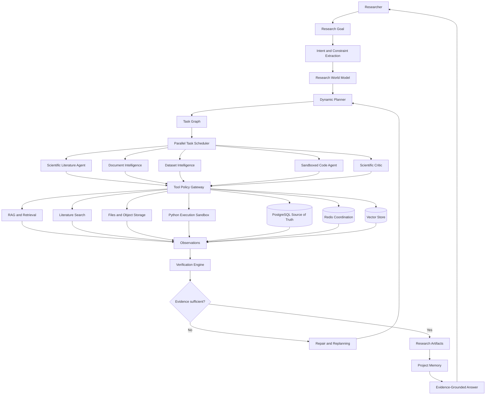

# ResearchOS

ResearchOS is a production-grade autonomous AI research problem-solving platform. The current platform includes the development foundation through PLAN 14 citation-first answer generation.

## Target Architecture

ResearchOS is designed as an evidence-first research runtime. PostgreSQL owns transactional state, object storage owns uploaded binaries, Redis coordinates background work, and vector storage supports semantic retrieval without becoming the application database. Agents produce structured results that move through verification before claims, artifacts, and final answers are shown to the researcher.

## Local Development

1. Copy `.env.example` to `.env`.
2. Install Python dependencies with `pip install -e ".[dev]"`.
3. Install Node dependencies with `npm install`.
4. Start infrastructure and apps with `make dev`.

## Commands

- `make dev`: start Docker Compose services.
- `make test`: run Python and web tests.
- `make lint`: run Ruff, MyPy, and web lint.
- `make format`: format Python and web code.
- `make migrate`: apply Alembic migrations.
- `make migration message="name"`: create an Alembic migration.

## Implemented Scope

- PLAN 00: API, web shell, worker shell, infrastructure services, tests, linting, migrations, and documentation.
- PLAN 01: users, organizations, memberships, password hashing, bearer tokens, refresh-token rotation, logout, `GET /users/me`, and authorization service.
- PLAN 02: tenant-scoped projects, persistent conversations, typed messages, pagination, and conversation soft deletion.
- PLAN 03: model gateway interfaces, deterministic local chat provider, SSE chat streaming, normalized provider failure events, and model usage recording.
- PLAN 04: login, registration, projects, project workspace, settings, billing, ChatGPT-style research chat shell, conversation navigation, run progress, attachment control, and artifact panel.
- PLAN 05: tenant-scoped file upload, listing, download, deletion, SHA-256 hashing, MIME/extension validation, duplicate tracking, and storage-provider abstraction.
- PLAN 06: PostgreSQL-backed durable job records, job creation/status API, idempotency keys, retry state, and worker job runner.
- PLAN 07: structured scientific PDF document schema, deterministic parser adapter, document/element persistence, and worker parse handler.
- PLAN 08: structured scientific table extraction, normalized table/row/column/cell persistence, and simple structure-based table QA.
- PLAN 09: scientific figure extraction, VLM adapter boundary, structured figure descriptions, and tenant-scoped persistence.
- PLAN 10: semantic chunking around structured document elements with tenant, project, page, section, and source-element metadata.
- PLAN 11: vector store interface, Chroma-compatible implementation, and tenant/project-scoped semantic vector search.
- PLAN 12: dense retrieval, lexical retrieval, and reciprocal-rank-fused hybrid scientific retrieval.
- PLAN 13: deterministic reranking adapter boundary and serializable EvidencePack construction with source/page/section preservation.
- PLAN 14: citation-first answer composition with structured claims and citation validation against EvidencePack items.

This project intentionally does not yet include agents, real billing transactions, research runtime behavior, or a production LLM provider adapter.
