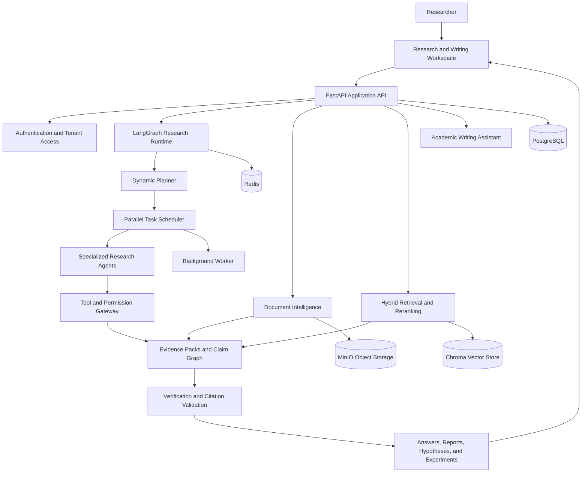

# ResearchOS

ResearchOS is an evidence-first, multi-agent platform for scientific research and academic writing. It combines document intelligence, hybrid retrieval, research agents, verification, experiment tooling, and an editable writing workspace in one system.

The repository currently contains a working full-stack foundation with a Next.js research workspace, a FastAPI backend, durable data models, background workers, model-provider adapters, scientific document processing, and tested agent workflows. The long-term goal is to turn a research question, paper, or dataset into a traceable workflow whose claims remain connected to evidence.

## Project Highlights

- Built a multi-tenant research platform with authentication, projects, conversations, file attachments, streaming chat, background jobs, and artifact tracking.
- Implemented scientific PDF, table, figure, and dataset processing with structured metadata and source provenance.
- Developed hybrid dense and lexical retrieval, reranking, evidence packs, citation-first answers, and claim verification.
- Created specialized agents for literature discovery, gap analysis, hypothesis generation, novelty auditing, feasibility review, scientific criticism, statistical review, and hypothesis ranking.
- Added a LangGraph-based research runtime with planning, task scheduling, repair and replanning, resumable execution, and observable agent progress.
- Built an academic writing workspace with editable sections, section-specific prompts, contextual sentence generation, IEEE-style references, and AI-assisted drafting.
- Added guarded tool execution, MCP-compatible tool discovery, sandboxed Python execution, experiment provenance, budget controls, and security validation.

## Development Summary

The core engineering foundation is implemented across the frontend, backend, research runtime, document pipeline, retrieval system, scientific agents, experiment tooling, and academic writing workspace. The repository includes automated tests and architecture documentation for these capabilities.

Production hardening and real-world evaluation are still in progress. The next phase focuses on deeper end-to-end agent integration, stronger document parsing, live scholarly data providers, collaborative writing, broader evaluation, and production operations.

## Architecture



PostgreSQL is the source of truth for transactional records. MinIO stores uploaded binaries, Redis supports coordination and background work, and Chroma provides semantic retrieval. Generated claims pass through evidence and verification layers before they are presented as research output.

## What Is Already Built

### Research Workspace

- Registration, login, bearer-token authentication, token rotation, logout, and tenant authorization.
- Organization-scoped projects, persistent conversations, typed messages, pagination, and soft deletion.
- A responsive Next.js workspace with project navigation, streaming chat, attachments, research-run status, artifact views, and visible agent progress.
- An editable academic document canvas with section prompts for introductions, literature reviews, methodology, results, discussion, and conclusions.
- Context-aware sentence suggestions with accept, reject, and regenerate controls, plus IEEE-style reference output.

### Documents and Retrieval

- Validated file upload, download, listing, deletion, duplicate detection, and storage-provider abstraction.
- Structured PDF parsing with page, section, element, table, and figure metadata.
- Semantic chunking that preserves tenant, project, page, section, and source-element provenance.
- Dense and lexical search combined through reciprocal-rank fusion.
- Reranking and serializable evidence packs that retain source and page information.
- CSV dataset profiling for inferred types, missing values, duplicates, descriptive statistics, correlations, leakage hints, and longitudinal visits.

### Research Intelligence

- Scientific literature search behind provider-neutral interfaces with query expansion, filtering, deduplication, caching, and stable ranking.
- Evidence-grounded gap analysis and structured hypothesis generation with falsification criteria.
- Hypothesis lineage, mutation, combination, specialization, rejection, and ancestor traversal.
- Novelty, feasibility, scientific critic, statistical reviewer, and hypothesis tournament agents.
- Claim and evidence graphs supporting provenance, contradiction detection, and citation validation.
- Citation-first answer composition that rejects unsupported evidence references.

### Agent Runtime and Tools

- LangGraph-compatible research orchestration with context compilation, planning, scheduling, bounded retries, repair, and resumable runs.
- Risk-classified tool execution with approval checks, rejection handling, audit records, and tenant-bound authorization.
- MCP-compatible typed tool discovery and execution through the same policy gateway.
- Sandboxed Python execution with disabled networking, resource limits, timeouts, read-only container roots, and structured outputs.
- Experiment specifications, append-only runs, code and dataset provenance, reproducibility records, and statistical checks.
- OpenAI, OpenAI-compatible, and Ollama model gateways, including a deterministic local provider for development and tests.

### Platform Engineering

- FastAPI application services, SQLAlchemy async persistence, Alembic migrations, and worker-based durable jobs.
- Immutable credit ledger, resource metering, budget-aware planning, and verified payment-webhook foundations.
- Prompt-injection, tenant-scope, object-path, SSRF, and high-risk tool security checks.
- Correlated observability events and evaluation models for retrieval, citations, latency, cost, recovery, and task completion.
- Docker Compose development environment for the API, web application, worker, PostgreSQL, Redis, Chroma, and MinIO.
- Python and React test suites, strict MyPy configuration, Ruff checks, TypeScript checks, and CI configuration.

## Current Status

ResearchOS is an actively developed engineering prototype. Its core domain models, services, agents, API routes, workspace, and automated tests are implemented. Several external systems use adapter boundaries or deterministic implementations so the platform remains reproducible during development.

The project should not yet be described as a fully production-deployed autonomous researcher. Production model credentials, live literature-provider accounts, infrastructure hardening, large-scale evaluation, and end-user acceptance testing are still required.

## Next Development Priorities

- Connect every specialized research agent to the end-to-end workspace flow and persist all generated document revisions.
- Improve sentence-level generation so each suggestion uses the accepted document context, retrieved evidence, and non-duplicative continuation logic.
- Add live scholarly search integrations and stronger bibliographic metadata validation for IEEE and additional citation styles.
- Expand PDF parsing quality for complex layouts, equations, scanned documents, tables, and figure references.
- Replace remaining deterministic adapters with production retrieval, reranking, model, payment, and remote-agent integrations where appropriate.
- Add collaborative editing, autosave, document import/export, reference management, and version comparison.
- Run larger retrieval, citation, agent-quality, security, load, and recovery evaluations against representative scientific corpora.
- Complete production deployment automation, secret management, backups, monitoring, and operational runbooks.

## Technology Stack

| Layer | Technologies |
| --- | --- |
| Frontend | Next.js 15, React 19, TypeScript, Tailwind CSS, Vitest, Testing Library |
| Backend | Python 3.12, FastAPI, Pydantic, SQLAlchemy Async, Alembic |
| Agent runtime | LangGraph, typed research-agent services, model gateway adapters |
| Data and retrieval | PostgreSQL, Redis, Chroma, MinIO, hybrid lexical and vector retrieval |
| AI providers | OpenAI, OpenAI-compatible APIs, Ollama, deterministic local test provider |
| Infrastructure | Docker Compose, background worker service, GitHub Actions |
| Quality | Pytest, Ruff, strict MyPy, TypeScript compiler checks |

## Repository Structure

```text
apps/
  api/                 FastAPI routes, application services, persistence, and tests
  web/                 Next.js research and academic writing workspace
  worker/              Durable background-job execution
packages/
  agents/              Specialized scientific and research agents
  billing/             Credit ledger, metering, budgets, and payments
  core/                Shared security and deployment policies
  documents/           PDF, table, figure, and dataset intelligence
  evaluation/          Reproducible system evaluation
  evidence/            Evidence and claim structures
  execution/           Sandbox, experiments, repair, and reproducibility
  observability/       Structured runtime events
  rag/                 Chunking, retrieval, evidence packs, and cited answers
  tools/               MCP and external integration gateways
  verification/        Claim, evidence, and citation verification
  writing/             Academic writing assistance
docs/                  Architecture decisions and API documentation
infra/                 Docker images and infrastructure configuration
migrations/            Alembic database migrations
```

## Local Development

### Prerequisites

- Docker Desktop with Docker Compose
- Python 3.12+
- Node.js 20+

### Start the Complete Stack

```powershell
Copy-Item .env.example .env
docker compose up --build
```

After startup:

- Web application: `http://localhost:3000`
- API documentation: `http://localhost:8000/docs`
- MinIO console: `http://localhost:9001`

Apply migrations if the database has not been initialized:

```bash
docker compose exec api alembic upgrade head
```

### Run Without Docker

```bash
pip install -e ".[dev]"
npm install
alembic upgrade head
```

Run the API and web application in separate terminals:

```bash
uvicorn apps.api.app.main:app --reload --port 8000
npm --workspace apps/web run dev
```

## Development Commands

- `make dev` starts the Docker Compose stack.
- `make test` runs Python and web tests.
- `make lint` runs Ruff, strict MyPy, and TypeScript checks.
- `make format` formats Python and web source files.
- `make migrate` applies Alembic migrations.
- `make migration message="description"` creates a migration.

## CV Summary

**Project Description:** Developed ResearchOS, a full-stack, evidence-first multi-agent scientific research and academic writing platform. The system transforms research questions, PDFs, and datasets into traceable literature analyses, hypotheses, experiment plans, cited answers, and editable research documents.

**Core Responsibilities:** Designed and implemented the end-to-end architecture, including multi-tenant APIs, scientific document intelligence, hybrid retrieval and RAG, evidence and citation verification, specialized research agents, LangGraph orchestration, sandboxed experiment execution, an editable academic writing workspace, automated testing, security controls, and containerized infrastructure.

**Technology Stack:** Python, FastAPI, LangGraph, Pydantic, SQLAlchemy, PostgreSQL, Redis, Chroma, MinIO, Next.js, React, TypeScript, Tailwind CSS, Docker Compose, Pytest, Vitest, Ruff, MyPy, and GitHub Actions.

### CV Achievement Bullets

- Engineered an evidence-first research platform spanning document processing, RAG, agent orchestration, scientific verification, experiment tooling, and academic writing.
- Built specialized agents for literature discovery, gap analysis, hypothesis generation, novelty assessment, feasibility review, scientific criticism, statistical review, and hypothesis ranking.
- Developed a multi-tenant FastAPI and Next.js application backed by PostgreSQL, Redis, Chroma, and MinIO, with Docker-based local infrastructure and automated Python and React quality checks.
- Implemented provenance-aware retrieval and citation workflows that preserve source, page, section, claim, and evidence relationships across generated research outputs.

## License

No license has been published for this repository yet. All rights are reserved unless a license file is added.
